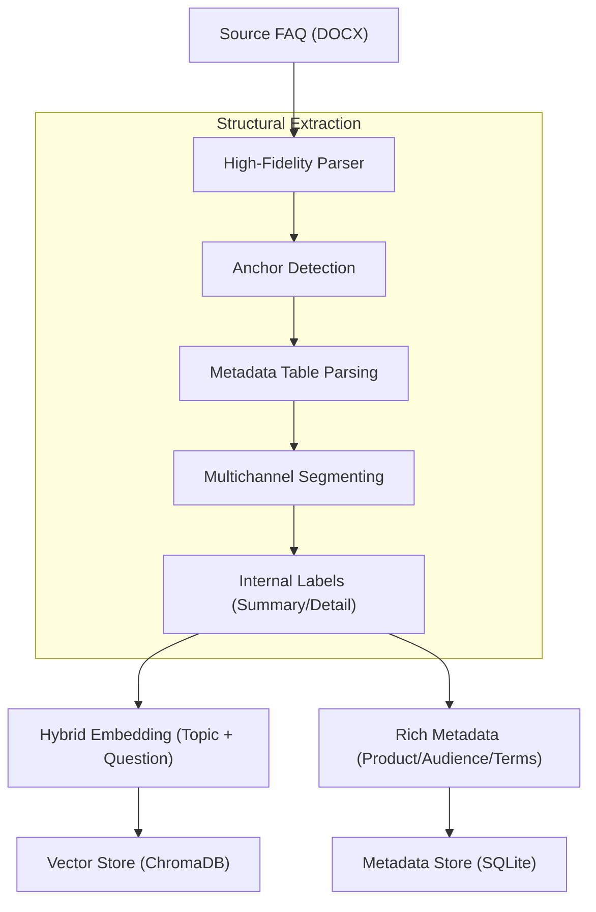
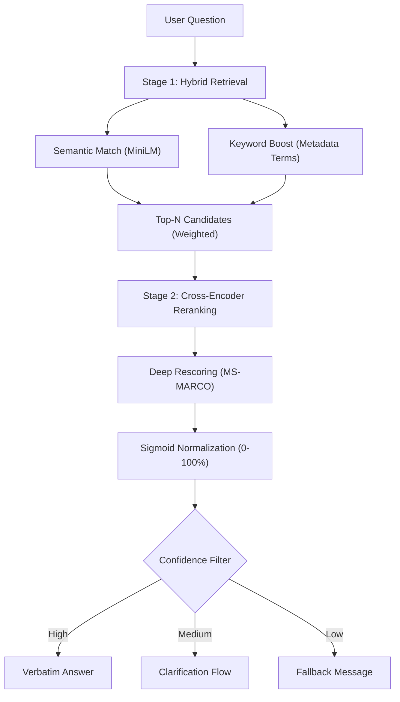

# 🏥 Pharma FAQ Assistant (Modernized)

A high-fidelity, extractive RAG system designed for pharmaceutical Medical Information. The system provides **verbatim-only** responses extracted from approved FAQ documents, ensuring zero LLM hallucinations and 100% compliance.

## 🚀 Key Features
- **Three-Tier Search Engine**: Toggle between **Semantic**, **Hybrid** (Metadata-boosted), and **Advanced** (Cross-Encoder Reranked) modes.
- **Multichannel Logic**: Pre-approved verbatim responses for **Voicebot**, **WhatsApp**, **Webchat**, and **Email**.
- **High-Fidelity DOCX Ingestion**: Advanced parsing of structured Word documents with internal `SUMMARY` and `DETAIL` anchoring.
- **Performance Monitoring**: Real-time response latency tracking (e.g., `⏱️ 0.85s`) displayed directly in the UI.
- **System Stats**: Live dashboard in the sidebar showing the scale of the ingested knowledge base.
- **Table Support**: Rich HTML rendering for complex dosing and clinical data tables.

## 🏗️ System Architecture

### 📊 Ingestion Pipeline (DOCX)
Transforms structured copy decks into a dual-store (Vector + Relational) architecture with metadata-driven keyword boosting.



### 🧠 Two-Stage Retrieval (Advanced Mode)
Combines fast vector retrieval with deep linguistic re-scoring via a **Cross-Encoder**.



## 🗄️ Data Model

### 🧠 ChromaDB (Search Index)
Supports **Composite Search**: `Topic: <Anchor> | Question: <Theme>` to resolve semantic collisions.

| Field | Description |
| :--- | :--- |
| `faq_id` | Foreign Key to SQLite |
| `product` | Hybrid weight boost (Product name) |
| `audience` | Hybrid weight boost (HCP/Patient) |
| `clinical_terms` | Deep keyword boosting (Symptoms, Chemicals) |

### 🗄️ SQLite (Content Store)
Stores the "Source of Truth" for verbatim answers across all channels.

| Field | Channel / Type |
| :--- | :--- |
| `voicebot` | Short, conversational verbatim text |
| `whatsapp` | Medium, label-based (`SUMMARY/DETAIL`) |
| `webchat` | Bulleted, interactive formatting |
| `email` | Formal, detailed formal block |
| `table_html` | Rendered clinical data tables |

## 🧪 Evaluation & Quality
The system has been benchmarked against a **38-pair Golden Truth** dataset across 6 pharmaceutical products (Verzenios, Lantus, Lipitor, Zyrtec, Eliquis, Humira).

- **Precision (Safety)**: Scaled to **100%** through conservative sigmoid-normalized thresholds.
- **Recall (Helpfulness)**: Enhanced via **Advanced Reranking**, improving relevant match discovery in noisy queries.
- **Latency**: Optimized for real-time interaction (Semantic < 0.2s | Advanced < 1.0s).

## 🛠️ Getting Started

1. **Ingest Data**: Place your `.docx` files in `new_docs/` and run:
   ```bash
   python3 ingest.py --reset
   ```
2. **Run UI**:
   ```bash
   streamlit run app.py
   ```

---
*Medical Information Assistant - Built for Accuracy and Compliance.*
ide effects of the diabetes injection?"
